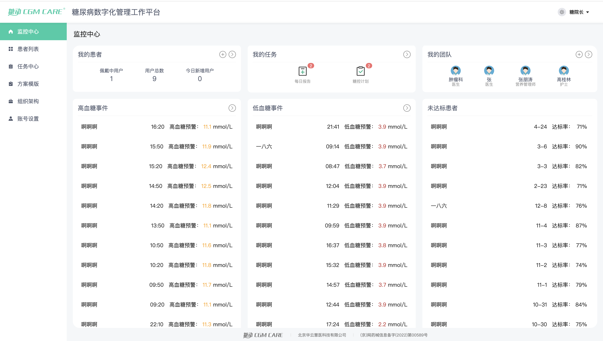
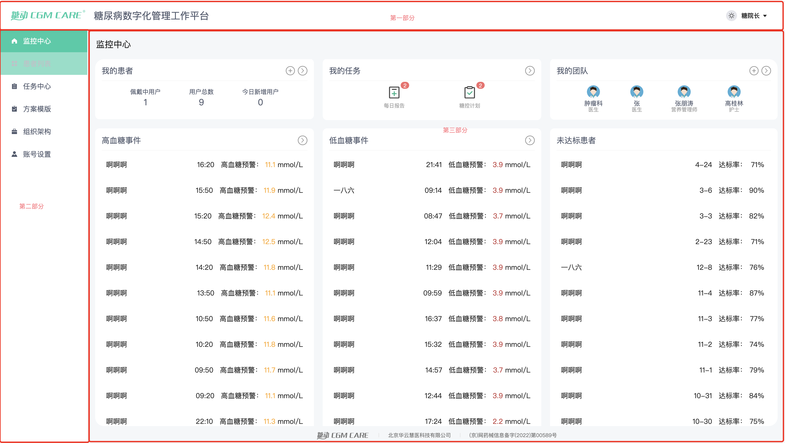
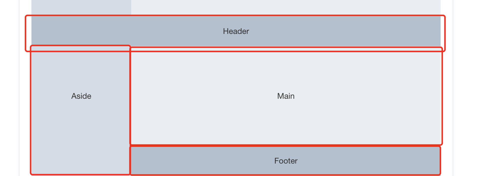
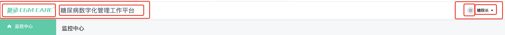

# 第三天

- 对页面布局有一个初步的认识，并学会分析页面结构

***

1. 如下图：


## 当我们拿到设计稿后通常是一个这样的图形界面，那么我们要如何利用框架，将这个页面复原呢？来看以下几个步骤：


1. 分析页面布局；

2. 选择框架内适用的方案；

3. 对页面进行大概还原；

4. 对细节进行调整。

## 先来看下图是，如何分析页面的



- 第一步，进行最简单最浅层的页面分析，我在页面内大致划分了几个区域。这就是页面分析的步骤，从浅到深，从外到内，逐级逐层分析。

## 选择框架内适用的方案：



- 我们可以看到，在elementUI中有[类似的布局](https://element.eleme.io/#/zh-CN/component/container)，我们直接拿过来试试看。结果当然是可行的。

## 对页面进行大致还原

**在对页面进行大致还原前，我们要做一些准备工作，防止一些意想不到的意外。**
***

### 假设一种情况：我现在想在顶部分成左中右三部分，那怎么办呢？如何让我的代码看起来更为简洁？

- 答案当然是通过组件去做啦！

### 在了解了组件的基本用法和应该如何做了之后我们就可以开始在elementUI中寻找组件对页面进行简单的还原

- 通过这张图片我们可以大致明白，可以先将最外层的骨架代码拿过来


```
    <el-container>
        <el-header>Header</el-header>
        <el-container>
                <el-aside width="200px">Aside</el-aside>
                <el-container>
                    <el-main>Main</el-main>
                    <el-footer>Footer</el-footer>
                </el-container>
        </el-container>
    </el-container>
```

- 接下来还原头部


```
    <el-header>
        <el-row>
            <el-col :span="12">
                <div class="grid-content bg-purple"></div>
            </el-col>
            <el-col :span="12">
                <div class="grid-content bg-purple-light"></div>
            </el-col>
        </el-row>
    </el-header>
```

- 尝试还原左侧导航，这里没有什么页面结构，可以直接拿[elementUI中存在的侧边导航](https://element.eleme.io/#/zh-CN/component/menu)来使用

```
    <el-aside width="200px">
        <el-col :span="12">
            <h5>自定义颜色</h5>
            <el-menu default-active="2" class="el-menu-vertical-demo" background-color="#545c64" text-color="#fff" active-text-color="#ffd04b">
            <el-submenu index="1">
                <i class="el-icon-location"></i>
                <span>导航一</span>
            </el-submenu>
            <el-menu-item index="2">
                <i class="el-icon-menu"></i>
                <span slot="title">导航二</span>
            </el-menu-item>
            <el-menu-item index="3" disabled>
                <i class="el-icon-document"></i>
                <span slot="title">导航三</span>
            </el-menu-item>
            <el-menu-item index="4">
                <i class="el-icon-setting"></i>
                <span slot="title">导航四</span>
            </el-menu-item>
            </el-menu>
        </el-col>
    </el-aside>
```

**通过[elementUI官网的文档](https://element.eleme.io/#/zh-CN/component/menu#menu-attribute)可以了解其中的一些属性是做什么的，比如background-color等**

- 接下来是内容部分，这一部分还是比较简单的， 大致可以分为中上两部分，那么我们通过之前可以发现，可以将头部和中间部分拿过来即可。

```
    <el-main>
        <el-container>
            <el-header>Header</el-header>
            <el-main>Main</el-main>
        </el-container>
    </el-main>

```

## 如何更细致的划分页面的每一部分，可以通过以下图片了解到。


